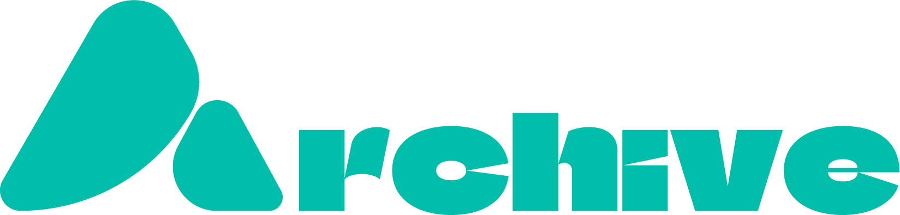
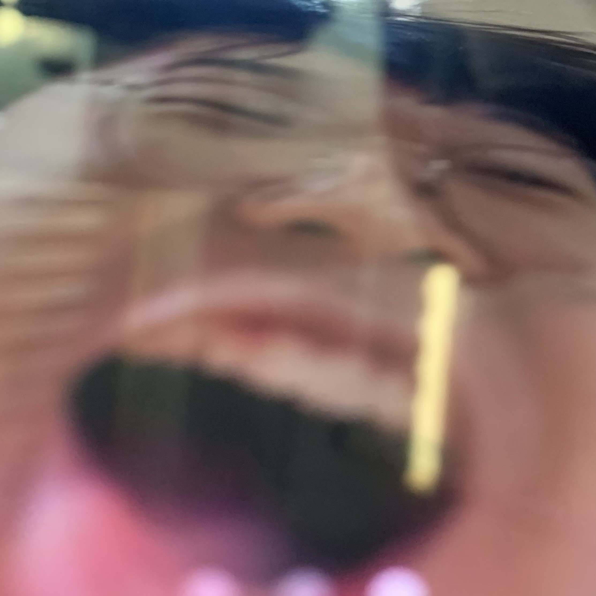
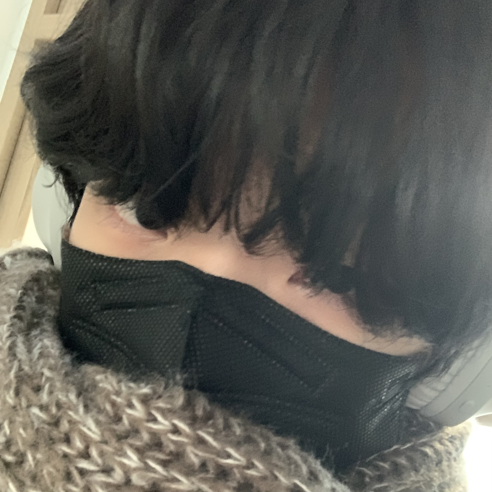
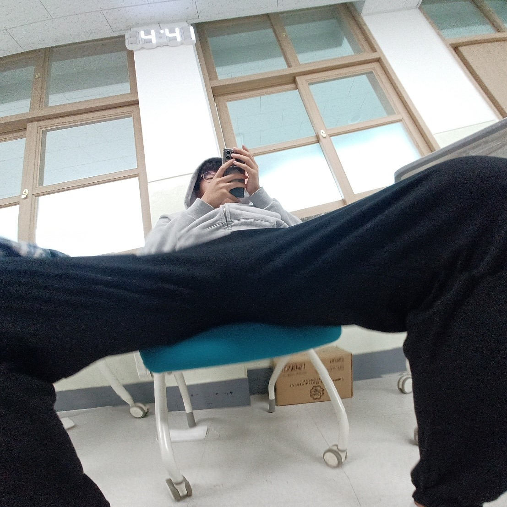

# **Archive**
**당신의 것을 다시 당신에게로**

### **🖥️ 프로젝트 소개**
ERICA GAME 코딩대회 작품 `23.08.28 ~ 23.09.10`

---

### **🚩 팀원 소개**

||||
|:---:|:---:|:---:|
|**김선태 (조장)**|**강찬영**|**정상윤**|
|미정|프로그래밍|미정|
|미정|게임 디자인|미정|

---

## **🍱 개발 환경 / 라이브러리**

|환경 및 라이브러리|버전|설명|
|:---:|:---:|:---:|
|Python|3.10.6|기본 Python|
|ursina|5.3.0|Python 3D 게임엔진 라이브러리|

